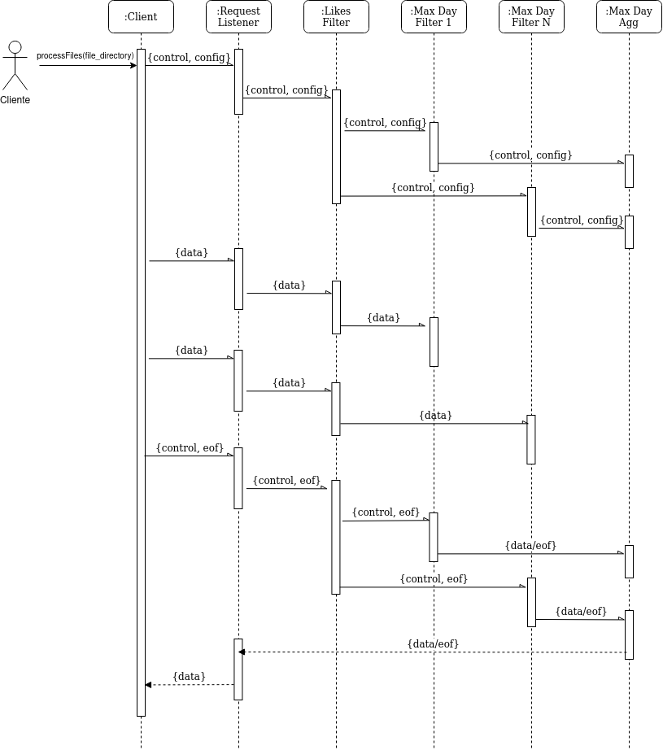
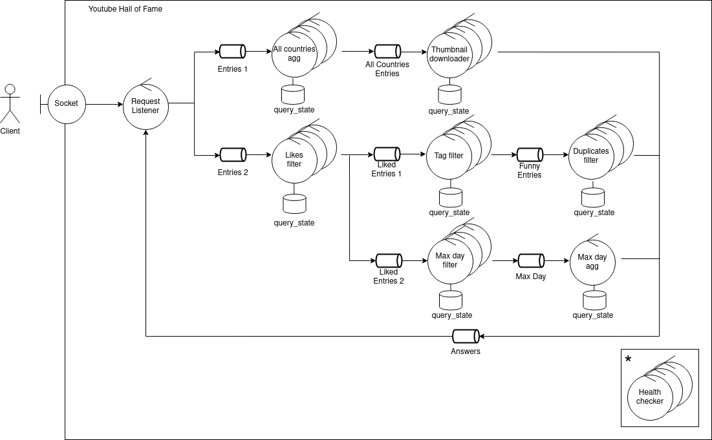

# TP2: Tolerancia a Fallos
 **Agustín Cambiano** ,**Barreneche Franco**


## Índice

[TOC]

## Problema a solucionar

### Objetivos

**Descripción breve de objetivos  similar a la diapositiva**

El objetivo del presente trabajo consiste en implementar un sistema distribuido con alto potencial de escalabilidad que permita un procesamiento paralelo de datos. Se hace énfasis especialmente en la tolerancia a fallos. Esto se debe a que al realizarse los cálculos en una red compuesta por varias computadoras se presenta un ambiente impredecible de ejecución, podría en cualquier momento desconectarse alguno de los centros de procesamientos de datos. A pesar de esto, nuestro programa debería evitar un fallo catastrófico, entrando en un estado de recuperación, de forma tal que eventualmente pueda volver a un estado normal de procesamiento, continuando todo trabajo que tuviera pendiente. 


### Escenarios


*Diagrama de casos de uso*


**C1: Obtener día con mayor cantidad de vistas totales** 

*Actores: Cliente*

*Flujo principal:*

1 - Cliente ingresa configuración de consulta

2 - Sistema responde ack

3 - Cliente ingesta entrada por entrada datos al sistema

4 - Sistema responde ack a cada dato.

5 - Cliente indica fin de datos.

6 - Sistema responde día con mayor cantidad de vistas totales y fin de datos.


**C2: Obtener videos funny populares**

Actores: Cliente.

Flujo principal:

1 - Cliente ingresa configuración de consulta

2 - Sistema responde ack

3 - Cliente ingesta entrada por entrada datos al sistema.

4 - Sistema responde con los videos funny populares.

5 - Cliente indica fin de datos.

6 - Sistema responde día con fin de datos.


**C3: Obtener thumbnail de videos trending**

Actores: Cliente.

Flujo principal:

1 - Cliente ingresa configuración de consulta

2 - Sistema responde ack

3 - Cliente ingesta entrada por entrada datos al sistema.

4 - Sistema responde con thumbnail de videos trending.

5 - Cliente indica fin de datos.

6 - Sistema responde día con fin de datos.


**C4: Interrumpir servicio**

Actores: Administrador, Cliente.

Flujo principal:

1 - Administrador envía señal de interrupción.

2 - Sistema interrumpe consultas de Cliente y se detiene.


### Alcance

El sistema deberá responder a los escenarios planteados en la sección correspondiente, presentando alta disponibilidad y  tolerancia a fallos.

Una vez alcanzado un estado correcto por primera vez, ante el fallo de un nodo,  éste deberá recuperarse automáticamente y el conjunto de operaciones a su cargo deberá continuar. Se contemplará la preservación de datos relevantes al negocio, así como al control para la garantía de la correctitúd de los resultados.

El sistema deberá procesar concurrentemente solicitudes de clientes, aunque se admitirá la posibilidad de limitar la cantidad de encargos gestionados en simultáneo.

Se desarrollarán protocolos propios tanto para la preservación de datos, como para su remoción cuando ya no sean necesarios. 

No formará parte del alcance de éste trabajo la recuperación ante fallas de hardware de almacenamiento catastróficas, ni la preservación de conexiones o restauración del trabajo ante una eventual reconexión.

Se relegará a un middleware de terceros las garantías vinculadas al manejo de mensajes, como ser preservación de mensajes ante la falla de uno de los extremos o la preservación del órden.

Los nodos del sistema se concentrarán en containers. Podrá utilizarse la API de Docker para el inicio, reinicio y detenimiento de containers, no así para obtener información del estado del sistema.


## Arquitectura de Software

**Agregar descripción a grandes rasgos (inspirarse en robustez)**


Para la ejecución de las tareas con alto throughput se consideró adecuado el planteo de una arquitectura del tipo pipeline, cuyas colas intermedias son gestionadas por un middleware de mensajes externo.

Bastó con acompañar los mensajes con un id de query para separar el estado local de cada nodo y sumar una ganancia en paralelismo por la intercalación de operaciones entre solicitudes clientes.

Los clientes se comunican por un socket TCP a un único punto de entrada y salida del sistema (y un único punto de falla). En una primer fase ingestan al sistema entrada por entrada los datos a procesar y  luego quedan a la espera de mensajes de respuesta.

Se cuenta con un cluster de health-monitors que se comunican con el resto del sistema para detectar nodos caídos y reiniciarlos. Dada su simpleza y tamaño, estos mensajes se intercambian por sockets UDP.


## Vista Lógica


*DAG global de tareas*

El DAG previo muestra una división lógica de tareas, sus dependencias y el flujo de datos (se excluyen señales de control). Se observa como solo un subconjunto de campos de los datos de entrada son necesarios para dar respuesta a las consultas planteadas y como la mayoría de dichos campos pueden descartarse tras su uso. Existe  una correspondencia uno a uno entre etapas del pipeline y tareas, con la salvedad del filtrado de videos trending en todos los países por 21 días, que finalmente se redujo a una sola etapa, para disminuir redundancia de operaciones.


COMPLETAR?????????? **Hablar de hash**
Como se indicó previamente, uno de los objetivos de este sistema distribuido es tener un poder de escalamiento extremadamente grande. Debido a esto, se quiere poder dividir la carga del procesamiento de datos en varias unidades de cómputo distintas, de forma tal que se reduzca el tiempo de espera de un cliente. En este proyecto, para poder cumplir con lo recientemente establecido, se decidió realizar un balance de carga utilizando una función de hashing, que genera resultados uniformemente distribuidos.  

Para aprovechar estas funcionalidades correctamente, se asignó a cada nodo de cada etapa del pipeline un número de id, el cual se utilizaría para determinar junto con el valor del hash del dato a qué nodo se redirigiría este para ser procesado. Esto se hizo no solo con funcionalidades de balance de carga, sino que también con el objetivo de facilitar la implementación de la tolerancia a fallas, ya que el determinismo de la función de hashing sobre un dato permite asegurar que este siempre será enviado al nodo que tenga el id que resuelte de aplicarle la función de hashing.

Al poder en cualquier momento producirse una caída de un servicio, cancelando así el procesamiento obligatorio de un dato, se genera la necesidad de recalcular este procesamiento para poder continuar con la normal ejecución de tareas del pedido del cliente. Si se utilizara un balanceo de cargas del tipo round robin o similar, de forma tal que un mismo dato pueda terminar en distintos nodos para ser procesado en distintas ocasiones, entonces se debería tener un método de persistencia de logs centralizado al cual deben acceder todos los nodos que procesan los datos, ya que todo mensaje recibido podría ser uno que logró procesar otro nodo, además de producir otros problemas de coordinación y de eficiencia por acceso a un recurso único. Al utilizar el sistema de hashing, se garantiza que cada dato irá siempre al mismo nodo, por lo que cada uno puede tener su propio sistema de persistencia de logs, sin tener que tener acceso a los resultados de procesamiento de los otros nodos, ignorando así la limitación de tener que acceder a un recurso único compartido por varios consumidores.


**F - Incluir diag. estados de health-monitor y explicar**


*Diagrama de clases del middleware*

Se encapsuló la lógica de recepción y envío de mensajes entre canales y sockets en una capa de middleware que cada etapa del pipeline consumía. El diagrama presenta la jerarquía de clases interna de los filtros del middleware. _ExchangeQueueIn, _ExchangeQueueOut y _TCPQueue ocultan los detalles del modo en que se serializan y transmiten los mensajes, mientras que _BaseFilter reúne el compartamiento común a todo filtro, como ser la administración de las colas y el procesamiento de señales. _ConnectionFilter especializa _BaseFilter para el manejo de conexiones con RabbitMQ y finalmente ExchangeExchangeFilter, TCPExchangeFilter y ExchangeTCPFilter abstráen los detalles más delicados de la inicialización de las colas y presentan al usuario una interfaz uniforme y sencilla.


## Vista de Procesos

****

**F - Mejorar mismo caso, monigote/actor de sistema, Ajustar activación y media flecha (asincrónica)**



*Diagrama de secuencia flujo de día máximo*


El flujo del cálculo del día máximo permite destacar aspectos relevantes del protocolo general de comunicación. El contenido específico de los mensajes no es el foco de éste diagrama, es suficiente conocer que existen mensajes de datos y de control. Los primeros corresponden al negocio, mientras que los segundos pueden ser del tipo config o eof.

La señal de eof no es un capricho, se requiere su emisión tanto para resetear los filtros que presentan estado, como para concluir operaciones potencialmente infinitas. Más aún, todo retorno de los cálculos, por la naturaleza del pipeline, es opcional y diferido.

El nodo destino de los mensajes de data se desprende de su contenido... **A - Hablar de hash?**

Los mensajes de control siempre se transmiten por multicast a todas las réplicas del siguiente nodo del pipeline. En el caso de los eof es necesario que todas las replicas anteriores lo hayan emitido para propagarlo. Para el config es suficiente que se reciba y propague una sola vez, si se recibe nuevamente sencillamente se descarta. Esta metodología no solo evita mensajes innecesarios, sino que además garantiza que antes de recibir cualquier dato de la solicitud del cliente se recibirá un config, si al recuperarse de una caída un nodo recibe eof de una consulta sin config o datos puede ignorarlo, pues el único caso en el que eso pasaría es cuando al recibir el último eof se borra el archivo de log de una consulta y el container se reinicia antes de emitir el ack hacia atrás.


**Health monitors (diagrama pendiente)**

Para el monitoreo del estado de los contenedores se dispuso un cluster de "health-monitors" con comportamiento homogéneo, en donde un lider electo visita secuencialmente los servicios a monitorear  (incluído el cluster de health-monitoring) y sus respaldos se preparan para tomar su lugar ante su caída.

El consenso de para la elección de lider se alcanza mediante una ligera variante del algoritmo Bully donde el nodo con mayor id no se anuncia automáticamente como líder,sino que participa del proceso de elección, aunque evidentemente ganará.  Se decidió seguir este camino para que pueda apreciarse el intercambio de mensajes de elección, puesto que el nodo con mayor id no se encuentra inactivo por mucho tiempo.

Los exchanges o colas  de rabbit permiten desentenderse de los detalles de comunicación pero para esta aplicación su overhead y durabilidad entorpecen un proceso que es en esencia muy simple. Un mesh TCP es apto para el intercambio de mensajes largos pero nuevamente se consideró demasiado para el problema a enfrentar. 

 Se dispuso que el líder recorra en  roundrobin una lista de nombres (que el DNS de docker traduce a direcciones IP) y envíe un número incremental por sockets UDP. Cada container cuenta con un proceso escucha en la dirección y puerto apropiada y hace eco del mensaje recibido. Mientras el lider recibe el número como respuesta espera. Si se cumple un timeout se reenvía el mensaje y se repite la espera hasta 3 veces. Entonces se considera fallido el nodo consultado y se ordena por *docker in docker* que se reinicie.


**Actividades mostrando funcionamiento mini de sistema**


*Flujo de recuperación de estado de archivo de log*

Todo nodo debe ser capaz de recuperar su estado ante una falla y posterior reinicio. El estado incluye la reconstrucción de estructuras de dato pertinentes a la consulta, los últimos mensajes recibidos y procesados (para garantizar idempotencia de mensajes) y el último id utilizado para emitir un mensaje, de modo tal que el siguiente nodo pueda diferenciar los mensajes que ya proceso solo inspeccionando este id.

Se debió brindar tolerancia ante cortes de luz y otras situaciones en donde ni siquiera puede confiarse en la correcta escritura de información en disco, por lo que dentro de un solo nodo debió diseñarse un protocolo de escritura como los que se estudia para bases de datos, aunque notablemente más sencillo.

Se crea un archivo csv por consulta, cuya estructura típica se enseña a continuación:

```
w,3,1,0,4/10/1997,BR
c,
w,2,0,1,4/10/1997,BR
c,
w,1,3,2,8/12/1998,KR
c,
```

Las entradas precedidas por *w* (write) almacenan la información útil, los campos son: el id del nodo de donde provino el mensaje, id del mensaje que ingresó, id de mensaje propio y campos opcionales de clave y valor, cuyo parseo puede complejizarse de ser necesario.  Múltiples entradas w pueden encontrarse antes de un commit .

Para las entradas precedidas por *c* (commits) dan por sentado el correcto procesamiento y envío de toda la información relevante  a ese mensaje.

Si ocurre una falla pueden ocurrir múltiples situaciones. En general, todo conjunto de writes que no han sido confirmados por un commit se descartan y el archivo se trunca. Entonces el id del mensaje no se preserva en la tabla de últimos mensajes recibidos y el mensaje se procesa nuevamente.

Cuando una transacción finaliza, correctamente o por desconexión,  su archivo de log asociado puede borrarse.

El log evita cualquier corrupción del estado propio y la tabla de últimos mensajes recibidos evita la propagación de errores filtrando mensajes duplicados entre más de dos nodos.

Request listener no está sujeto en rigor a  los comportamientos aquí descritos. Debe tratarse especialmente para evitar que una cadena de mensajes duplicados (suceso extremadamente improbable, pero aún posible) se propague al cliente. Ante la falla de request listener se produce un flujo de desconexión que se explicará más adelante.


## Vista de Desarrollo

**Actualizar**


*Diagrama de paquetes de request_listener*


Como se adelantó en la sección anterior, casi todos los componentes del sistema se adhieren a la estructura de paquetes enseñada en el diagrama: Hacen uso de un filtro base del middleware, que se encarga de la declaración de colas y la interacción con ellas y que al recibir un mensaje invoca una callback especificada en su construcción.

Actualmente, request_listener es el único que emplea colas TCP. En tal caso el middleware hace uso de módulos de transmisión y comunicación confiable de datos por sockets.  Server.py encapsula solo la lógica de escucha y aceptación de conexiones entrantes. 


## Vista Física




*Diagrama de robustez*


Como puede observarse, la mayoría de los filtros están pensados para permitir su escalamiento.

Request Listener es la excepción, ya que si se preserva la táctica de long polling no puede descomponerse la conexión TCP de los clientes con facilidad. Ante su eventual falla se interrumpen las conexiones y las transacciones deben comenzar desde el principio. Persistir un id incremental de consulta evitaría que los datos a medio procesar de transacciones pasadas se interpretasen como parte de nuevas consultas, pero en algún momento tal id haría overflow. Por ello se envía un mensaje especial de desconexión que jamás se descarta. La respuesta al mensaje de desconexión es eliminar el estado de la consulta y propagar el mensaje por el pipeline. No es necesario evitar mensajes duplicados, ya que la operación es idempotente por naturaleza. 

Cuando se comienza a procesar una consulta, en request listener se crea un archivo vacío cuyo nombre es el id de la consulta. Si el cliente se desconecta (exitosa o excepcionalmente) se envía el mensaje de desconexión y se borra el archivo que representaba la consulta. Si request listener falla repentinamente, cuando se recupera toma del nombre de los archivos el id de las transacciones interrumpidas y envía mensajes de desconexión para cada una de ellas. Luego borra los archivos y usa como siguiente id de consulta uno más que el mayor id encontrado.


**Hablar de request listener como punto único de falla y protocolo de desconexión**


*Diagrama de despliegue*

Claramente existe gran dependencia del middleware de colas, que en este caso es RabbitMQ. Por lo demás, cada nodo puede ser desplegado independientemente.


## Ejecución

Para ejecutar el sistema debe colocarse el archivo `config.ini`  provisto en la raíz del repositiorio, en la carpeta **.data** (crear si no existe). Crear también dentro de **.data** un directorio **datasets** con los archivos csv de países que el cliente procesará. Asegurarse de que los dos caracteres iniciales del nombre de los archivos sean únicos.

Iniciar el sistema con `sh run.sh` y detenerlo cuando acabe el procesamiento con `sh stop.sh`.

El cliente guardará los archivos resultantes de la ejecución en **.data/output**.
