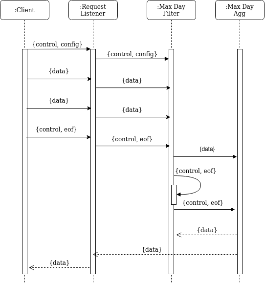
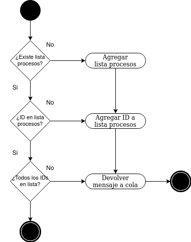

# TP1: Youtube Hall of Fame
### Barreneche Franco

## Ejecución

Para ejecutar el sistema debe colocarse el archivo `config.ini`  provisto en la raíz del repositiorio, en la carpeta **.data** (crear si no existe). Crear también dentro de **.data** un directorio **datasets** con los archivos csv de países que el cliente procesará. Asegurarse de que los dos caracteres iniciales del nombre de los archivos sean únicos.

Iniciar el sistema con `sh run.sh` y detenerlo cuando acabe el procesamiento con `sh stop.sh`.

El cliente guardará los archivos resultantes de la ejecución en **.data/output**.

## Arquitectura

### Escenarios

*Diagrama de casos de uso*

La interacción con el sistema es más bien simple, los clientes se conectan secuencialmente con el servidor e ingresan los datos a procesar con el fin de obtener el día con mayor cantidad de vistas, videos con tag "funny" populares y los thumbnails de videos trending. Luego esperan su resultado. El sistema no se detiene por si mismo, pero un administrador puede interrumpirlo en cualquier momento a través de señales.

### Vista Lógica

*DAG global de tareas*

El DAG previo muestra una división lógica de tareas, sus dependencias y el flujo de datos (se excluyen señales de control). Se observa como solo un subconjunto de campos de los datos de entrada son necesarios para dar respuesta a las consultas planteadas y como la mayoría de dichos campos pueden descartarse tras su uso. Para la ejecución de las tareas se consideró adecuado el planteo de una arquitectura del tipo pipeline, con una correspondencia uno a uno entre etapas y tareas, con la salvedad del filtrado de videos trending en todos los países por 21 días, que finalmente se redujo a una sola etapa, para disminuir redundancia de operaciones y así mejorar el rendimiento.

*Diagrama de clases del middleware*

Se encapsuló la lógica de recepción y envío de mensajes entre canales y sockets en una capa de middleware que cada etapa del pipeline consumía. El diagrama presenta la jerarquía de clases interna de los filtros del middleware. _ChannelQueue y _TCPQueue ocultan los detalles del modo en que se serializan y transmiten los mensajes, mientras que _BaseFilter reúne el compartamiento común a todo filtro, como ser la administración de las colas y el procesamiento de señales. Finalmente ChannelChannelFilter, TCPChannelFilter y ChannelTCPFilter abstráen los detalles más delicados de la inicialización de las colas, ej: manejo de la conexión con RabbitMQ.

### Vista de Desarrollo

*Diagrama de paquetes de request_listener*

Como se adelantó en la sección anterior, casi todos los componentes del sistema se adhieren a la estructura de paquetes enseñada en el diagrama: Hacen uso de un filtro base del middleware, que se encarga de la declaración de colas y la interacción con ellas y que al recibir un mensaje invoca una callback especificada en su construcción.

Actualmente, request_listener es el único que emplea colas TCP. En tal caso el middleware hace uso de módulos de transmisión y comunicación confiable de datos por sockets.  Server.py encapsula solo la lógica de escucha y aceptación de conexiones entrantes. 

### Vista de Procesos

*Diagrama de secuencia flujo de día máximo*

El flujo del cálculo del día máximo permite destacar aspectos relevantes del protocolo general de comunicación. El contenido específico de los mensajes no es el foco de éste diagrama, es suficiente conocer que existen mensajes de datos y de control. Los primeros corresponden al negocio, mientras que los segundos pueden ser del tipo config o eof. La señal de eof no es un capricho, se requiere su emisión tanto para resetear los filtros que presentan estado, como para concluir operaciones potencialmente infinitas. Más aún, todo retorno de los cálculos, por la naturaleza del pipeline, es opcional y diferido. A continuación se ahondará en el automensaje de Max Day Filter. 

*Diagrama de actividades para broadcast entre copias*

La comunicación de información de control resultó ser un gran desafío de diseño, pues no solo debía llegar a todas las copias de un componente, sino que también debía respetar el órden de mensajes junto con los mensajes de datos. Aunque se evaluó utilizar canales separados de broadcast internos, finalmente se optó por un protocolo que trabaja solo con la cola de entrada ,que es compartida entre control y datos.

El diagrama explica claramente el protocolo, pero no da cuenta de porqué está garantizada su terminación y su buen desempeño. Todo lo anterior esta dado por el fairness que provee RabbitMQ y el tipo de operaciones del negocio, cuyo tiempo de ejecución es casi independiente de los datos de entrada y por ende parejo entre las copias. Por ejemplo, cuando se recibe la señal de eof, todo el resto de las copias podrían tener algunos mensajes pendientes por procesar y entonces la misma copia desencolará y encolará el mensaje de eof una y otra vez, pero tras este corto tiempo se liberarán progresivamente el resto de los nodos y gracias al fairness el mensaje de control tenderá a transmitirse en roundrobin, llegando solo a las copias necesarias, hasta que todos hayan recibido el mensaje. 

### Vista Física

*Diagrama de robustez*

 

Como puede observarse, la mayoría de los filtros están pensados para permitir su escalamiento. Max day agg y Request Listener son la excepción. Request Listener es un nodo crítico, no solo necesita ser único, sino que además su eventual falla puede dejar al resto de los componentes en un estado inválido. De modo que la caída de Request Listener conlleva el reinicio total del sistema. Por el contrario, Max day agg procesa un volumen de datos igual a la cantidad de copias de Max day filter y solo se activa intermitentemente. En el presente es también un punto de falla, pero podría solventarse fácilmente empleando una variable "máximo actual" en modo archivo. 

*Diagrama de despliegue*

Claramente existe gran dependencia del middleware de colas, que en este caso es RabbitMQ. Por lo demás, cada nodo puede ser desplegado independientemente. Por la implementación, actualmente las copias de un mismo filtro deben estar en el mismo dispositivo (pues comparten archivos por volúmenes de docker), pero realmente ninguna de las tareas requiere acceso a la totalidad de los datos. Si se garantiza la afinidad de los datos, sea mediante un sistema de archivos distribuído o sencillamente con un routekey que dependa de un atributo de los datos (ej: video_id), entonces esta restricción sobre el escalamiento desaparecería.